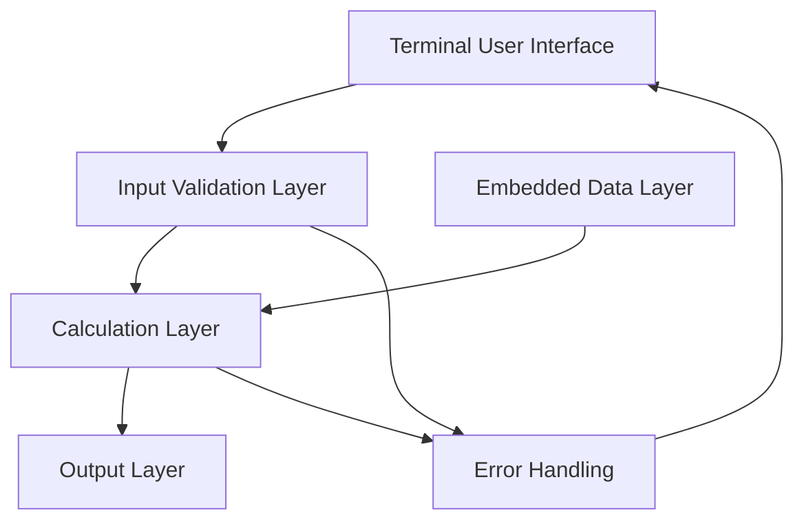
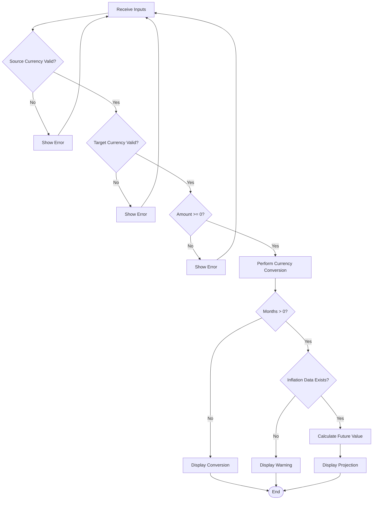
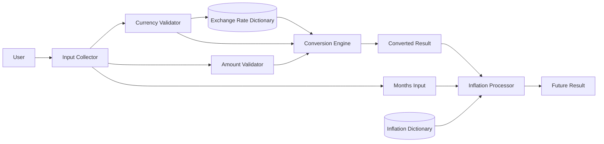
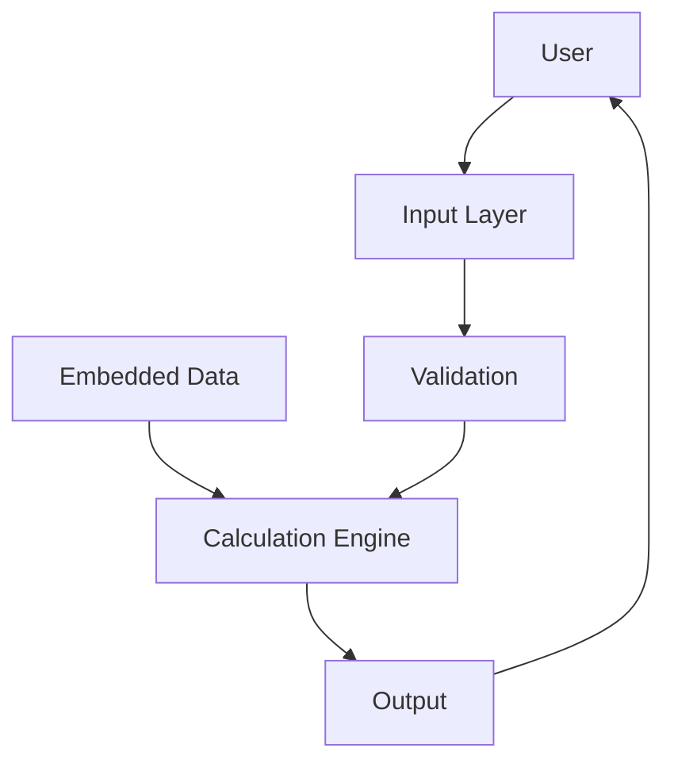
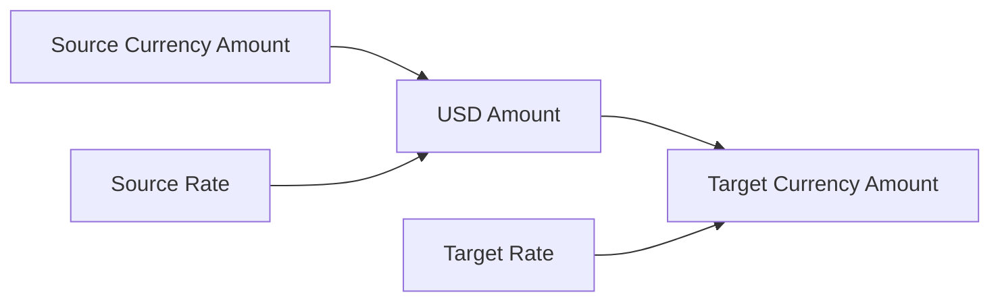
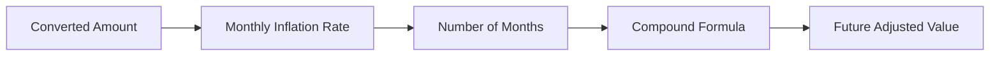
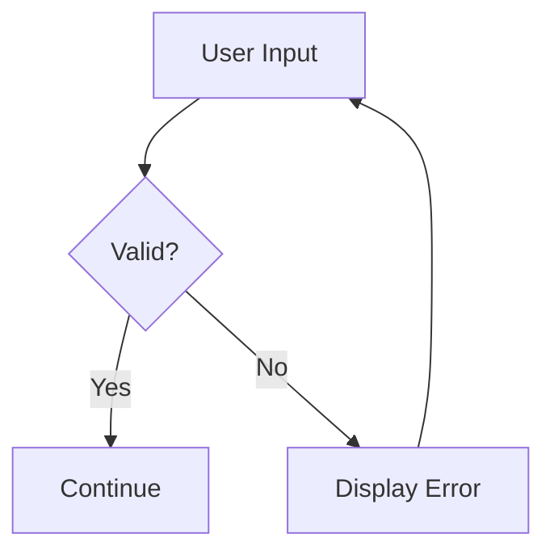

# 🎨 Design.md — System Design

## 1. Design Overview

The Terminal Currency & Inflation Calculator uses a simple modular design.

The system consists of:

1. Embedded data.
2. Input validation.
3. Currency conversion logic.
4. Inflation projection logic.
5. Output formatting.
6. Exception handling.

No database, external API, framework, or third-party Python package is required by the current implementation.

---

## 2. High-Level Architecture



---
## 3. Module Design

### Module 1 — Exchange Rate Data

**Variable:**

```python
EXCHANGE_RATES
```

**Type:**

```python
dict
```

**Purpose:**

Stores currency exchange rates relative to USD.

**Example:**

```python
{
    "USD": 1.00,
    "INR": 95.88,
    "EUR": 0.86924
}
```

---

### Module 2 — Inflation Data

**Variable:**

```python
INFLATION_RATES
```

**Type:**

```python
dict
```

**Purpose:**

Stores monthly inflation rates.

A `None` value indicates unavailable data.

---

### Module 3 — Currency Names

**Variable:**

```python
CURRENCY_NAMES
```

**Type:**

```python
dict
```

**Purpose:**

Converts a currency code into a readable name for output.

---

### Module 4 — Currency Input Validation

**Function:**

```python
get_currency_code(prompt_text)
```

### Pseudocode

```text
FUNCTION get_currency_code(prompt_text)

    REPEAT forever
        READ user input
        REMOVE spaces
        CONVERT input to uppercase

        IF code exists in EXCHANGE_RATES
            RETURN code
        ELSE
            DISPLAY error
        END IF
    END REPEAT

END FUNCTION
```

---

### Module 5 — Number Validation

**Function:**

```python
get_positive_number(prompt_text)
```

### Pseudocode

```text
FUNCTION get_positive_number(prompt_text)

    REPEAT forever

        TRY
            READ input
            CONVERT input to float

            IF value >= 0
                RETURN value
            ELSE
                DISPLAY error
            END IF

        IF conversion causes ValueError
            DISPLAY invalid-number error
        END TRY

    END REPEAT

END FUNCTION
```

---

### Module 6 — Main Controller

**Function:**

```python
main()
```

The main function coordinates the entire application.

### Main sequence

```text
Start
 ↓
Display heading
 ↓
Read source currency
 ↓
Validate source currency
 ↓
Read target currency
 ↓
Validate target currency
 ↓
Read amount
 ↓
Validate amount
 ↓
Read months
 ↓
Convert source → USD
 ↓
Convert USD → target
 ↓
Display result
 ↓
Check months
 ↓
If months > 0:
     Get inflation rate
     ↓
     If rate exists:
          Calculate future value
     Else:
          Display unavailable-data warning
 ↓
End
```

---

## 5. Detailed Conversion Design

The program does not require a direct exchange rate for every currency pair.

Instead, it uses USD as a common base.

### Example

Suppose:

```text
1 USD = 95.88 INR
1 USD = 0.86924 EUR
```

To convert INR → EUR:

```text
INR → USD → EUR
```

### Formula

```text
USD = INR Amount / 95.88
```

Then:

```text
EUR = USD × 0.86924
```

This produces:

```text
EUR = INR Amount × (0.86924 / 95.88)
```

---

## 6. Inflation Projection Design

The inflation module runs only when:

```python
months > 0
```

The program retrieves:

```python
inflation_rate = INFLATION_RATES.get(to_code)
```

### Case A — Data Exists

The program calculates:

```python
future_value = converted_amount * (
    (1 + (inflation_rate / 100)) ** months
)
```

### Case B — Data Does Not Exist

If:

```python
inflation_rate is None
```

the program does not calculate a projection.

Instead, it displays an availability warning.

---

## 7. Decision Flow



---

## 8. Data Flow



---

## 9. Class Diagram Equivalent

The current program does **not use classes or OOP**. Therefore, a traditional UML class diagram would not accurately represent the implementation.

A functional-module representation is more appropriate:

```text
+--------------------------+
| currency_calculator.py   |
+--------------------------+
| EXCHANGE_RATES           |
| INFLATION_RATES          |
| CURRENCY_NAMES           |
+--------------------------+
| get_currency_code()      |
| get_positive_number()    |
| main()                   |
+--------------------------+
```

---

## 10. Input/Output Design

### Input 1 — Source Currency

```text
Enter the 'From' currency code (e.g., AUD):
```

Example:

```text
USD
```

### Input 2 — Target Currency

```text
Enter the 'To' currency code (e.g., JPY):
```

Example:

```text
INR
```

### Input 3 — Amount

```text
Enter the amount in USD:
```

Example:

```text
100
```

### Input 4 — Months

```text
Enter number of months to project for inflation (0 for none):
```

Example:

```text
6
```

---

## 11. Output Design

The application uses separators to make sections visually clear:

```text
============================================================
💵 CONVERSION RESULT
============================================================
```

The conversion output contains:

```text
From : ...
To   : ...
```

The inflation output contains:

```text
------------------------------------------------------------
📈 INFLATION PROJECTION
------------------------------------------------------------
```

---

## 12. Data Dictionary

| Data Structure | Key | Value | Purpose |
|---|---|---|---|
| `EXCHANGE_RATES` | Currency code | Float | USD-based exchange rate |
| `INFLATION_RATES` | Currency code | Float / `None` | Monthly inflation percentage |
| `CURRENCY_NAMES` | Currency code | String | Human-readable currency name |

---

## 13. Graphs and Diagrams

### 13.1 System Architecture Graph



### 13.2 Currency Conversion Graph



### 13.3 Inflation Projection Graph



### 13.4 Error Handling Graph



---

## 14. Performance Design

### Time Complexity

Dictionary lookup:

```text
O(1) average
```

Currency calculation:

```text
O(1)
```

Inflation calculation:

```text
O(1)
```

### Space Complexity

The data structures require:

```text
O(n)
```

where `n` is the number of stored currency entries.

The calculation itself requires constant additional working memory.

---

## 15. Reliability Design

Reliability is supported by:

- Validation loops.
- `try/except ValueError`.
- Explicit missing-inflation handling.
- `KeyboardInterrupt` handling.
- `.strip()` for whitespace cleanup.
- `.upper()` for case-insensitive currency-code entry.

---

## 16. Maintainability Design

The current design is intentionally simple.

### Good maintainability characteristics

- Data is separated from calculations.
- Repeated validation is placed in functions.
- `main()` coordinates the workflow.
- Meaningful variable names are used.
- Comments explain major sections.

### Recommended future separation

For a larger application:

```text
project/
│
├── main.py
├── data.py
├── conversion.py
├── inflation.py
├── validation.py
├── display.py
└── tests/
```

---

## 17. Validation Design

### Currency

```python
if code in EXCHANGE_RATES:
```

This ensures that the program has an exchange rate before attempting conversion.

### Amount

```python
if val >= 0:
```

This prevents negative amounts.

### Numeric Errors

```python
except ValueError:
```

This handles input such as:

```text
abc
hello
10x
```

---

## 18. Important Implementation Observations

### 18.1 Month Validation

The code currently does:

```python
months = int(get_positive_number(...))
```

Because `get_positive_number()` returns a float, a user entering:

```text
2.5
```

will produce:

```text
2
```

rather than an error.

**Recommended improvement:**

Explicitly request and validate an integer number of months.

---

### 18.2 Zero Is Accepted

The function is named:

```python
get_positive_number()
```

but uses:

```python
val >= 0
```

Therefore zero is accepted.

This is appropriate for the program because the prompt explicitly says:

```text
0 for none
```

but the function name could be changed to something such as:

```python
get_non_negative_number()
```

---

### 18.3 Embedded Data

The application depends on data directly written into the source code.

Advantages:

- Simple.
- Offline.
- No API key.
- Easy for a beginner to run.

Disadvantages:

- Rates can become outdated.
- Updating data requires editing the program.

---

### 18.4 Currency Names

`CURRENCY_NAMES` contains only some of the currency codes in `EXCHANGE_RATES`.

The code correctly uses:

```python
CURRENCY_NAMES.get(from_code, from_code)
```

so the application falls back to the code if the full name is unavailable.

---

## 19. Testing Design

### Unit-Level Testing Targets

Future unit tests should test:

```text
get_currency_code()
get_positive_number()
currency conversion formula
inflation formula
missing inflation data
currency-name fallback
```

### Integration-Level Testing

Test the entire flow:

```text
Input → Validation → Conversion → Inflation → Output
```

### Boundary Tests

Test:

```text
0
very large amount
very small decimal amount
0 months
1 month
large number of months
invalid currency
empty input
negative amount
text input
```

---

## 20. Test Matrix

| ID | Scenario | Expected Result |
|---|---|---|
| T01 | USD → INR | Conversion result |
| T02 | INR → USD | Conversion result |
| T03 | Lowercase `usd` | Accepted as USD |
| T04 | Unknown code | Validation error |
| T05 | Amount `100` | Accepted |
| T06 | Amount `0` | Accepted |
| T07 | Amount `-10` | Rejected |
| T08 | Amount `abc` | Error |
| T09 | Months `0` | No projection |
| T10 | Months `6` with data | Projection |
| T11 | Months > 0 without data | Warning |
| T12 | Ctrl+C | Graceful exit |

---

## 21. Deployment Design

### Requirements

- Python installed.
- Source file available.
- Terminal/command prompt.

### Execution

```bash
python currency_calculator.py
```

No additional package installation is required by the supplied code.

---

## 22. Security Design

The current application has a low external attack surface because:

- It does not use a network connection.
- It does not execute user input as Python.
- It does not store credentials.
- It does not connect to a database.

If a future API is added:

- Store API keys in environment variables.
- Validate API responses.
- Handle network failures.
- Avoid exposing credentials in source code.

---

## 23. Scalability Design

For the current terminal application, scalability is not a major concern because calculations involve only a few dictionary lookups.

If the project grows, the recommended architecture is:

```text
             +----------------+
             |   User / GUI   |
             +-------+--------+
                     |
             +-------v--------+
             | Application API|
             +-------+--------+
                     |
        +------------+------------+
        |                         |
+-------v-------+         +-------v-------+
| Conversion    |         | Inflation     |
| Service       |         | Service       |
+-------+-------+         +-------+-------+
        |                         |
        +------------+------------+
                     |
              +------v------+
              | Data Layer  |
              +-------------+
```

---

## 24. Design Principles Used

The project follows these basic principles:

1. **Separation of concerns** — data and input validation are separated from the main flow.
2. **Reuse** — validation functions avoid repeated input code.
3. **Simplicity** — no unnecessary frameworks or libraries.
4. **Readability** — clear names and formatted output.
5. **Error tolerance** — ordinary invalid inputs do not immediately terminate the program.
6. **Extensibility** — dictionaries can later be replaced by APIs or databases.

---

## 25. Final Design Summary

```text
                  USER
                   |
                   v
             TERMINAL INPUT
                   |
                   v
             VALIDATION
              /       \
             /         \
        Currency       Amount
        Validation    Validation
             \         /
              \       /
               v     v
            CALCULATION
                 |
        +--------+--------+
        |                 |
        v                 v
 Currency Conversion   Inflation
        |                 |
        +--------+--------+
                 |
                 v
              OUTPUT
                 |
                 v
                END
```

The current design is appropriate for a beginner-level Python project because it provides a clear separation between data, validation, calculation, and output while remaining simple enough to understand and modify.
