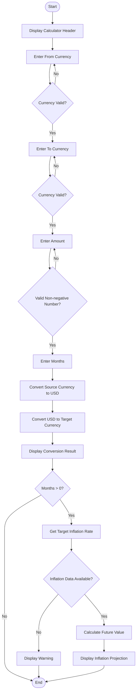
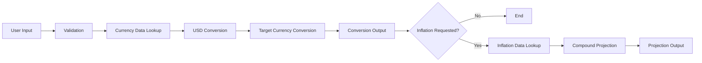
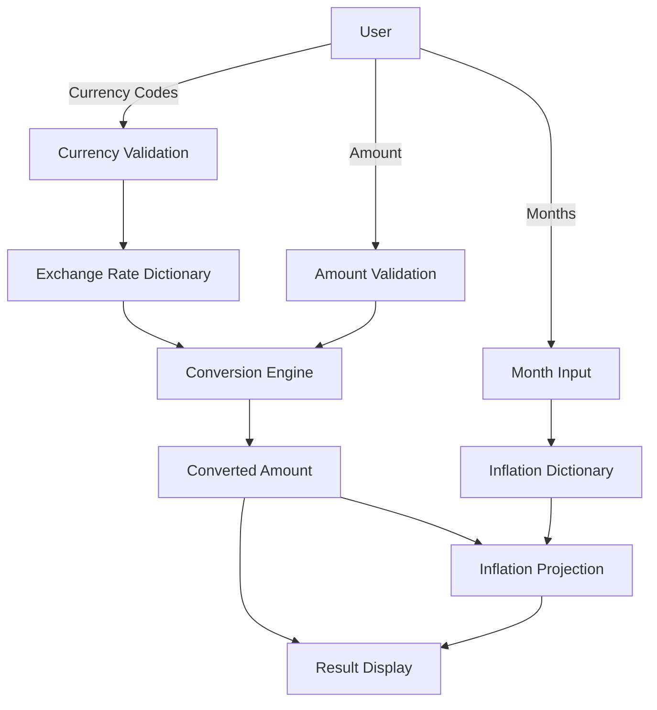

# 💱 Terminal Currency & Inflation Calculator

## 1. Project Overview

The **Terminal Currency & Inflation Calculator** is a Python-based console application that performs two related financial calculations:

1. **Currency conversion** between supported currencies.
2. **Inflation-adjusted value projection** for a selected number of future months.

The program uses embedded dictionaries instead of an external API. Exchange rates are stored with **USD as the base currency**, where:

> `1 USD = X units of the selected currency`

The application accepts currency codes, an amount, and an inflation-projection period through the terminal. It validates the currency and amount before performing the calculations.

---

## 2. Problem Statement

People frequently need to convert money from one currency to another for travel, education, international purchases, business, and financial planning. Manual conversion becomes inconvenient when many currencies are involved.

Currency values alone also do not show how inflation can affect the future value of money. A simple calculator can therefore combine currency conversion with an optional inflation projection.

### Formal Problem Statement

> Design and implement a Python terminal application that accepts a source currency, target currency, amount, and number of months, converts the amount through a USD-based exchange-rate system, and optionally calculates a future inflation-adjusted value using the target currency's stored monthly inflation rate.

The system should:

- Accept valid ISO-style currency codes.
- Reject unsupported currency codes.
- Accept non-negative numerical amounts.
- Convert the source amount to USD.
- Convert USD to the target currency.
- Display readable conversion results.
- Optionally calculate an inflation-adjusted future value.
- Handle unavailable inflation data.
- Handle invalid numerical input without terminating the normal input loop.
- Handle `Ctrl+C` gracefully.

---

## 3. Objectives

### Primary Objectives

- Build a working currency conversion calculator in Python.
- Store exchange-rate data in a structured dictionary.
- Convert between currencies using USD as a common base.
- Provide an optional inflation projection.
- Validate user input.
- Make the terminal output understandable for a beginner.
- Demonstrate core Python programming concepts.

### Secondary Objectives

- Keep the application independent of external APIs.
- Use functions to reduce repeated validation code.
- Handle common user input errors.
- Keep the program easy to modify and extend.

---

## 4. Main Features

| Feature | Description |
|---|---|
| Currency selection | User enters source and target currency codes |
| Currency validation | Checks whether a code exists in `EXCHANGE_RATES` |
| Amount validation | Accepts numerical non-negative values |
| Currency conversion | Converts source → USD → target |
| Currency names | Displays full names where available |
| Inflation projection | Projects target value for a specified number of months |
| Missing inflation handling | Displays a warning when inflation data is unavailable |
| Embedded data | No external database or API is required |
| Keyboard interrupt handling | Gracefully handles `Ctrl+C` |
| Terminal interface | Runs directly in a Python terminal |

---

## 5. Functional Modules

### 5.1 Embedded Exchange-Rate Data

Variable:

```python
EXCHANGE_RATES
```

Purpose:

- Stores exchange rates.
- USD is the base.
- Example:

```text
USD = 1.00
EUR = 0.86924
INR = 95.88
JPY = 155.85
```

Interpretation:

```text
1 USD = 95.88 INR
1 USD = 0.86924 EUR
1 USD = 155.85 JPY
```

The exact values are embedded in the supplied program and are labelled by the program as September 20, 2026 data.

---

### 5.2 Inflation Data Module

Variable:

```python
INFLATION_RATES
```

Purpose:

- Stores monthly inflation percentages.
- `None` means inflation data is unavailable for that currency.

Example:

```python
"INR": 0.4
"USD": 0.4
"CAD": -0.1
```

A positive value represents the stored monthly inflation percentage. A negative value represents a monthly decrease according to the supplied dataset.

---

### 5.3 Currency Name Module

Variable:

```python
CURRENCY_NAMES
```

Purpose:

- Maps selected currency codes to readable currency names.

Example:

```python
"USD": "United States dollar"
"INR": "Indian rupee"
"EUR": "Euro"
```

The dictionary contains names for a subset of the currencies present in the exchange-rate data. If a name is not available, the program falls back to displaying the currency code.

---

### 5.4 Currency Validation Module

Function:

```python
get_currency_code(prompt_text)
```

Responsibilities:

1. Read user input.
2. Remove leading/trailing spaces using `.strip()`.
3. Convert input to uppercase using `.upper()`.
4. Check the code against `EXCHANGE_RATES`.
5. Return the valid code.
6. Display an error and ask again for an invalid code.

---

### 5.5 Positive Number Validation Module

Function:

```python
get_positive_number(prompt_text)
```

Responsibilities:

1. Read user input.
2. Convert the input to `float`.
3. Reject negative values.
4. Catch `ValueError`.
5. Ask the user again when input is not numeric.

Important implementation detail:

The code accepts `0` because it checks:

```python
if val >= 0:
```

Therefore, the function technically accepts **non-negative numbers**, not strictly positive numbers.

---

### 5.6 Main Processing Module

Function:

```python
main()
```

Responsibilities:

- Display application heading.
- Display data-date notice.
- Collect user inputs.
- Perform currency conversion.
- Display the result.
- Perform optional inflation projection.
- Display warnings where inflation data is unavailable.

---

### 5.7 Keyboard Interrupt Module

The program uses:

```python
except KeyboardInterrupt:
```

This prevents an abrupt-looking termination when the user presses `Ctrl+C`.

The application displays:

```text
Calculator closed.
```

---

## 6. Currency Conversion Algorithm

The application uses USD as the intermediate/base currency.

### Step 1: Source Currency → USD

```text
amount_in_usd = amount / EXCHANGE_RATES[from_code]
```

### Step 2: USD → Target Currency

```text
converted_amount = amount_in_usd * EXCHANGE_RATES[to_code]
```

### Combined Formula

```text
Converted Amount =
Amount × (Target USD Rate / Source USD Rate)
```

Therefore:

```text
C = A × (Rtarget / Rsource)
```

Where:

- `A` = original amount
- `Rsource` = source currency units per USD
- `Rtarget` = target currency units per USD
- `C` = converted amount

---

## 7. Inflation Projection

If the user enters a number of months greater than zero, the program attempts to retrieve:

```python
INFLATION_RATES[to_code]
```

If data exists:

```text
Future Value =
Current Value × (1 + inflation_rate / 100) ^ months
```

### Example

If:

```text
Current value = 1000
Monthly inflation = 0.4%
Months = 6
```

Then:

```text
Future Value = 1000 × (1 + 0.004)^6
```

The program uses compound monthly projection.

### Important Interpretation

This is a mathematical projection based on the **single stored monthly rate**. It is not a forecast of actual future inflation.

---

## 8. System Workflow



---

## 9. Input → Processing → Output Model



---

## 10. Technology Stack

| Component | Technology |
|---|---|
| Programming language | Python |
| Interface | Terminal / Command Line |
| Data storage | Python dictionaries |
| Database | None |
| External API | None |
| External libraries | None |
| Operating environment | Any system with a compatible Python interpreter |

---

## 11. Program Architecture

The application follows a simple layered structure:

```text
+--------------------------------------+
|          User / Terminal             |
+-------------------+------------------+
                    |
                    v
+--------------------------------------+
|          Input & Validation          |
|  get_currency_code()                 |
|  get_positive_number()               |
+-------------------+------------------+
                    |
                    v
+--------------------------------------+
|          Business Logic              |
|  Currency Conversion                 |
|  Inflation Projection                |
+-------------------+------------------+
                    |
                    v
+--------------------------------------+
|            Embedded Data             |
|  EXCHANGE_RATES                      |
|  INFLATION_RATES                     |
|  CURRENCY_NAMES                      |
+--------------------------------------+
```

---

## 12. Error Handling

The application handles:

### Invalid Currency

Example:

```text
ABC
```

Output:

```text
[!] Error: 'ABC' is not a recognized currency code.
```

### Invalid Numeric Input

Example:

```text
hello
```

Output:

```text
[!] Error: Invalid input. Please enter a numerical value.
```

### Negative Amount

Example:

```text
-100
```

Output:

```text
[!] Error: Please enter a positive number.
```

### Missing Inflation Data

If the target currency has:

```python
None
```

the application displays a warning instead of performing the projection.

### Ctrl+C

The outer `try/except` handles keyboard interruption.

---

## 13. Non-Functional Requirements

### 13.1 Usability

- Simple terminal prompts.
- Clear headings.
- Human-readable output.
- Currency codes are automatically converted to uppercase.

### 13.2 Reliability

- Invalid currency input is repeatedly requested.
- Invalid numerical input is handled with `ValueError`.
- Missing inflation data is handled explicitly.
- Keyboard interruption is handled.

### 13.3 Performance

The application uses dictionary lookups, which are generally very fast for the small input workload of this program.

The conversion calculation itself is constant-time with respect to the number of stored currencies.

### 13.4 Maintainability

The program separates major responsibilities into:

- Data dictionaries
- Input functions
- Main processing function

This makes the application easier for a beginner to understand and modify.

### 13.5 Portability

The program uses standard Python functionality and does not depend on external Python packages.

### 13.6 Availability

Because data is embedded in the source code, the application does not require internet access or a live API to execute.

### 13.7 Accuracy

The mathematical conversion follows the stored USD-based rates correctly.

However, the final real-world accuracy depends entirely on the accuracy, date, and quality of the embedded rates.

---

## 14. Data Flow Diagram



---

## 15. Example

Suppose the user enters:

```text
From currency: USD
To currency: INR
Amount: 100
Months: 6
```

Using the supplied dataset:

```text
USD rate = 1.00
INR rate = 95.88
INR monthly inflation = 0.4%
```

Currency conversion:

```text
100 / 1.00 = 100 USD
100 × 95.88 = 9,588 INR
```

Inflation projection:

```text
Future Value = 9588 × (1 + 0.004)^6
```

The program displays the calculated future value to two decimal places.

---

## 16. Complexity Analysis

Let:

- `n` = number of currencies stored in a dictionary.

Dictionary lookup:

```text
Average time: O(1)
```

Currency conversion:

```text
O(1)
```

Inflation calculation:

```text
O(1)
```

Memory:

```text
O(n)
```

because the program stores currency data in dictionaries.

---

## 17. Testing Strategy

### Functional Test Cases

| Test | Input | Expected Result |
|---|---|---|
| Valid conversion | USD → INR, 100 | Conversion displayed |
| Valid conversion | EUR → JPY | Conversion displayed |
| Lowercase input | usd | Accepted as USD |
| Invalid currency | XYZ | Error and retry |
| Decimal amount | 125.50 | Accepted |
| Zero amount | 0 | Accepted |
| Negative amount | -50 | Rejected |
| Text amount | abc | Error and retry |
| Zero months | 0 | No inflation projection |
| Positive months | 6 | Projection attempted |
| Missing inflation | Target with `None` | Warning displayed |
| Ctrl+C | Press Ctrl+C | Graceful exit |

---

## 18. Known Limitations

1. Exchange rates are embedded and do not automatically update.
2. The program does not call a live exchange-rate API.
3. Inflation values are embedded and may become outdated.
4. The program uses USD as the intermediate currency.
5. Currency names are available only for a subset of supported exchange-rate codes.
6. The program is terminal-based and has no graphical interface.
7. There is no transaction history.
8. There is no file/database storage.
9. There is no authentication or user account system.
10. The number of months is obtained using `int(get_positive_number(...))`, so a decimal month input such as `2.5` is converted to `2` rather than rejected.
11. The code's error message says "positive number", but the validation actually allows zero.
12. Real-world future inflation cannot be guaranteed by applying one fixed monthly rate repeatedly.

---

## 19. Future Enhancements

Possible improvements include:

- Live exchange-rate API integration.
- Live inflation-data integration.
- Graphical User Interface (GUI).
- Currency search by full name.
- Currency symbols.
- Conversion history.
- Save results to CSV/JSON.
- Multiple conversion calculations in one session.
- Better month validation.
- Detailed validation for finite numeric values.
- More complete currency-name mapping.
- Unit tests.
- Logging.
- Database support.
- Historical exchange-rate graphs.
- Historical inflation graphs.
- Exportable reports.
- Web or mobile version.

---

## 20. Security Considerations

The application does not collect passwords, payment information, or personal data.

The main security considerations are:

- Input validation.
- Avoiding execution of user-provided input as code.
- Keeping future API keys outside source code if an API is added.
- Validating external data if live APIs are introduced.

---

## 21. Project Structure

Recommended documentation/project structure:

```text
Currency-Calculator/
│
├── currency_calculator.py
├── README.md
├── Statement.md
└── Design.md
```

If the program is expanded:

```text
Currency-Calculator/
│
├── currency_calculator.py
├── data/
│   ├── exchange_rates.json
│   └── inflation_rates.json
├── tests/
│   └── test_currency_calculator.py
├── README.md
├── Statement.md
└── Design.md
```

---

## 22. Conclusion

The Terminal Currency & Inflation Calculator is a compact Python project that demonstrates how structured data, functions, validation, arithmetic operations, and exception handling can be combined to solve a practical problem.

Its core workflow is:

```text
Input
  ↓
Validate
  ↓
Convert through USD
  ↓
Display currency result
  ↓
Optional inflation projection
  ↓
Display final result
```

The project is suitable for demonstrating beginner-level Python programming and can later be extended into a larger financial-information application.
